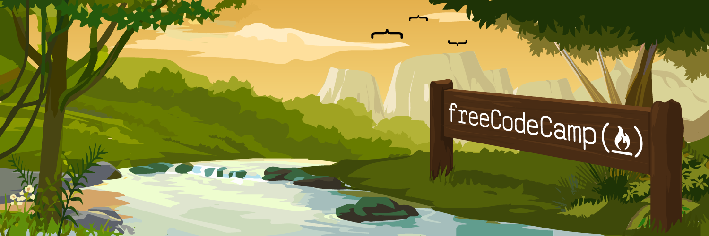

  

	
   
   

O **`FreeCodeCamp`** é uma plataforma de ensino de programação que possui como missão: 

>*Ajudar as pessoas a aprender a programar gratuitamente. Conseguimos isso criando milhares de vídeos, artigos e lições de codificação interativas - todos disponíveis gratuitamente para o público. Também temos milhares de grupos de estudo freeCodeCamp em todo o mundo.*

####:sparkles: **Os cursos oferecidos são:**

- [x] [Design responsivo para a web](./Responsive\ Web\ Design/)
- [ ] Algoritmos e estruturas de dados em JavaScript
- [ ] Bibliotecas de desenvolvimento em front-end
- [ ] Visualização de dados
- [ ] APIs e microsserviços
- [ ] Garantia de qualidade
- [ ] Computação científica com Python
- [ ] Análise de dados com Python
- [ ] Segurança da informação
- [ ] Aprendizado de máquina com Python

