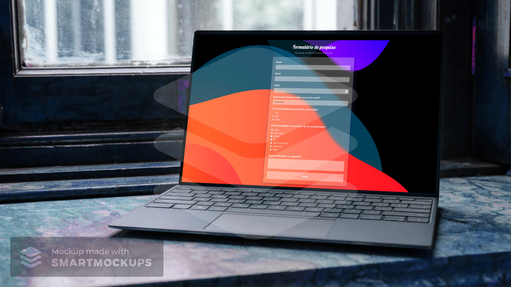
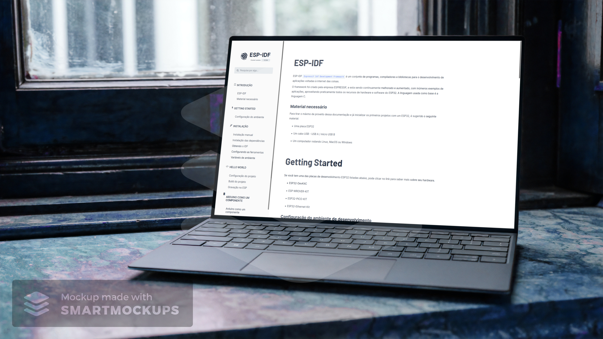
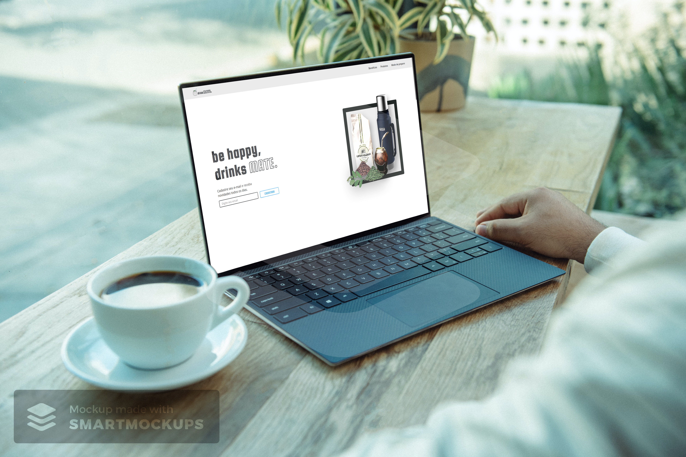

## Responsive Web Design

	
   
   

In this certification we learned the languages HTML (Hypertext Markup Language) and CSS (Cascade Style Sheet) for design. 

First, we learned how to build a photo app to learn the basics of HTML and CSS. Later, modern techniques such as CSS variables, and accessibility best practices are introduced. 

We also build web pages that respond to different screen sizes, using Flexbox and CSS Grid.

#### :rocket: Projects developed during certification:
    

    <b><a href="./Tribute Page">Tribute page</a></b>

  

    <b><a href="./Survey Form">Survey Form</a></b>

  

    <b><a href="./Technical Documentation Page">Technical Documentation Page</a></b>

  

    <b><a href="./Product Landing Page">Product Landing Page</a></b>

  

    <b><a href="./Personal Portfolio">Portfolio Webpage<a></b>

  

