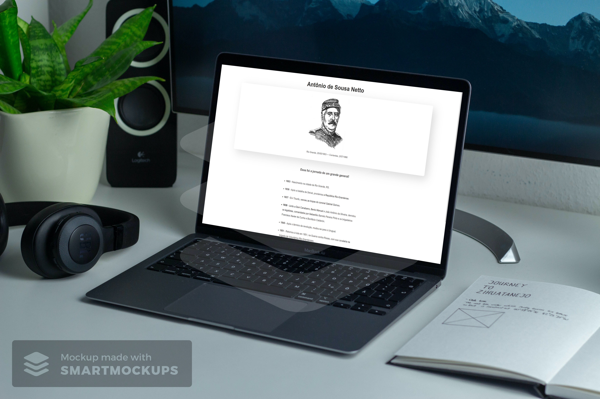
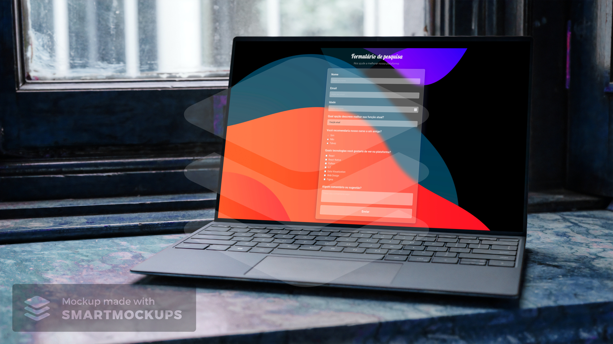
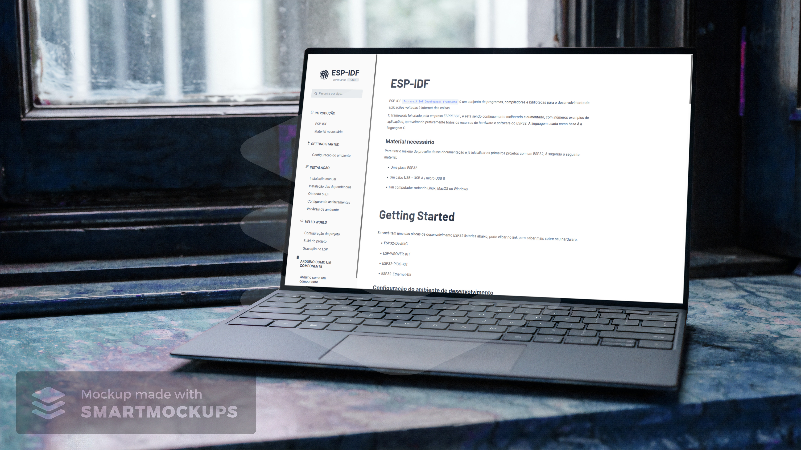
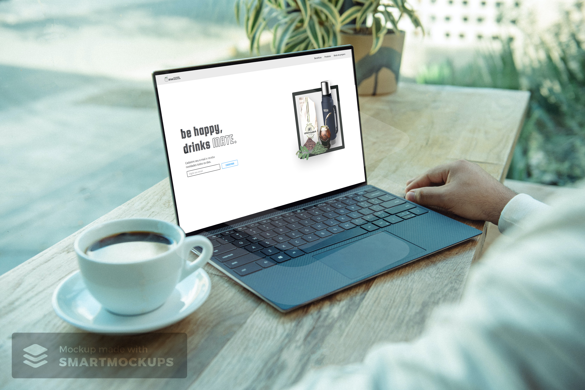
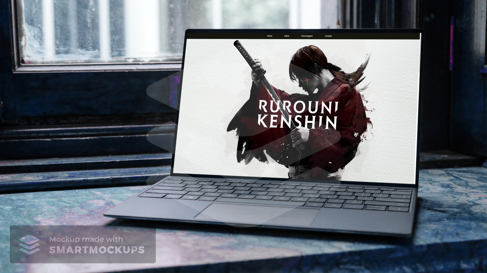

## Responsive Web Design

	
   
   

Nessa certificação aprendemos as linguagens HTML (Linguagem de Marcação de Hipertexto) e CSS (Folha de Estilo em Cascata) para o design.

Primeiro, aprendemos a construir um aplicativo de fotos para aprender o básico de HTML e CSS. Mais tarde, são apresentadas técnicas modernas como variáveis CSS, e melhores práticas de acessibilidade.

Construímos também, páginas web que respondem a diferentes tamanhos de telas, com o uso do Flexbox e com o CSS Grid.

#### :rocket: Projetos desenvolvidos durante a certificação:
    

    <b><a href="./Tribute Page">Tribute page</a></b>

  

    <b><a href="./Survey Form">Survey Form</a></b>

  

    <b><a href="./Technical Documentation Page">Technical Documentation Page</a></b>

  

    <b><a href="./Product Landing Page">Product Landing Page</a></b>

  

    <b><a href="./Personal Portfolio">Portfolio Webpage<a></b>

  

